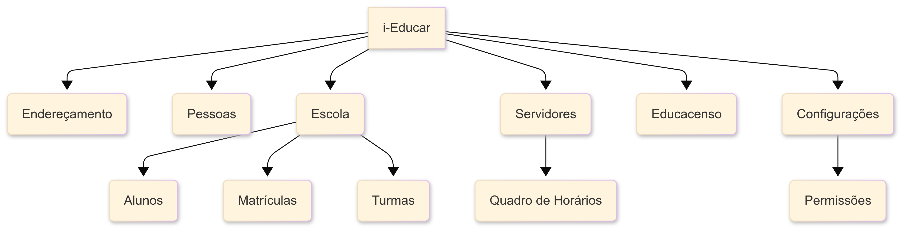

# Objeto de Estudo (Software)

## Aplicação escolhida

O **i-Educar** é um software livre de gestão escolar, totalmente online, projetado para otimizar a administração de redes de ensino municipais. A plataforma centraliza informações pedagógicas e de ensino, permitindo que secretários escolares, professores, coordenadores e gestores acessem dados em tempo real. Com isso, o i-Educar contribui para a redução do uso de papel, a eliminação da duplicidade de documentos e a racionalização do trabalho dos servidores públicos.

Desenvolvido originalmente pela prefeitura de Itajaí (SC) e disponibilizado no Portal do Software Público do Governo Federal em 2008, o i-Educar atende às necessidades das Secretarias de Educação e das escolas públicas de todo o Brasil.

**Link para o YouTube:** [Conheça o i-Educar](https://www.youtube.com/watch?v=AHZn3vDDijQ)

<iframe width="560" height="315" src="https://www.youtube.com/embed/AHZn3vDDijQ?si=e0AkwHmUcb4irTsB" title="YouTube video player" frameborder="0" allow="accelerometer; autoplay; clipboard-write; encrypted-media; gyroscope; picture-in-picture; web-share" referrerpolicy="strict-origin-when-cross-origin" allowfullscreen></iframe>

### Módulos e Funcionalidades

O i-Educar é organizado em módulos que abrangem todas as áreas da gestão escolar:

* **Endereçamento:** Cadastro e gerenciamento de informações de endereço, como ruas, bairros e CEPs.
* **Pessoas:** Cadastro de pessoas físicas e jurídicas, incluindo pais, alunos e professores, além de informações como deficiências, religião e cor/raça.
* **Escola:** O módulo central do sistema, onde são gerenciados os cadastros de escolas, alunos, matrículas, cursos, séries e turmas.
* **Servidores:** Cadastro de todos os servidores da rede de ensino, incluindo docentes e outros funcionários. O módulo também permite o gerenciamento do quadro de horários das turmas.
* **Educacenso:** Módulo dedicado à exportação de dados para o Censo Escolar e à importação de informações para a atualização do sistema.
* **Configurações:** Permite o gerenciamento de permissões de usuários, a realização de backups e o acesso a outras ferramentas administrativas.

### Arquitetura e Implicações para a Avaliação

A arquitetura do i-Educar é modular, o que facilita a análise de componentes específicos do sistema. O diagrama abaixo representa a estrutura de alto nível do software.

Essa estrutura de código aberto tem implicações diretas na nossa avaliação:

* **O que é possível medir:** Dado o acesso completo ao código-fonte no GitHub, podemos realizar uma análise estática aprofundada da **Manutenibilidade** do software, utilizando ferramentas para medir a complexidade do código, a duplicação e a aderência a padrões de desenvolvimento. Da mesma forma, a **Segurança** pode ser avaliada através da busca por vulnerabilidades conhecidas no código.
* **O que não é possível medir (Limitações):** A avaliação da **Confiabilidade** será limitada. Não temos acesso aos ambientes de produção das prefeituras que utilizam o sistema, o que nos impede de medir métricas de campo, como o Tempo Médio Entre Falhas (MTBF). Nossa análise se concentrará em indicadores preventivos, como a cobertura de testes automatizados presentes no repositório.

### Tecnologias utilizadas

O projeto utiliza majoritariamente **PHP**, com o uso de bibliotecas como:

* [Laravel](https://laravel.com/)
* [PHPUnit](https://phpunit.de/)
* [PestPHP](https://pestphp.com/)

Além disso, também faz uso de algumas bibliotecas **JavaScript**, como o framework **Bootstrap**.

### Links úteis

* [Repositório no GitHub](https://github.com/portabilis/i-educar)
* [Fórum da Comunidade](https://forum.ieducar.org/)
* [Telegram da Comunidade](https://t.me/ieducar)
* [Guia de Contribuição](https://github.com/portabilis/i-educar/blob/2.9/CONTRIBUTING.md)
* [Guia de Instalação](https://github.com/portabilis/i-educar/blob/2.9/INSTALL.md)
* [Código de Conduta](https://github.com/portabilis/i-educar/blob/2.9/CODE-OF-CONDUCT.md)

---

## Classificação do Produto

O i-Educar se classifica como um **Sistema de Gestão Educacional (SGE)** de código aberto. Ele é projetado para ser uma solução completa para a administração de redes de ensino, com foco em usabilidade, centralização de dados e conformidade com as regulamentações educacionais do Brasil, como o Censo Escolar.

---

## ODS Relacionados

Aqui descrevemos os Objetivos de Desenvolvimento Sustentável com os quais o i-Educar se conecta, com metas/indicadores relevantes e justificativas de como o software pode contribuir para alcançá-los.

### ODS 4 — Educação de Qualidade

> **Descrição:** Assegurar educação inclusiva, equitativa e de qualidade, e promover oportunidades de aprendizagem ao longo da vida para todos. [1]

**Metas relevantes (Brasil / IPEA):**

* **Meta 4.1:** Até 2030, garantir que todas as meninas e meninos completem o ensino primário e secundário gratuito, equitativo e de qualidade, com resultados de aprendizagem eficazes.
* **Meta 4.3:** Assegurar igualdade de acesso para todos os gêneros à educação técnica, profissional e superior de qualidade, a preços acessíveis, incluindo universidade.
* **Meta 4.4:** Aumentar substancialmente o número de jovens e adultos com habilidades relevantes, inclusive competências técnicas e profissionais, para emprego, trabalho decente e empreendedorismo.  
* **Meta 4.a:** Construir e melhorar instalações físicas para educação, apropriadas para crianças, sensíveis às deficiências e ao gênero, e que proporcionem ambientes de aprendizagem seguros, inclusivos e eficazes.  

**Indicadores relacionados:**  

* Proporção de jovens de 15-17 anos matriculados no ensino médio.
* Proficiência em leitura e matemática em diferentes fases do ensino fundamental.  
* Infraestrutura escolar (acessibilidade, segurança, salas e equipamentos).  

**Relação com o i-Educar:**

* Fornece dados precisos sobre matrícula, frequência, conclusão e desempenho acadêmico, apoiando o monitoramento das metas 4.1 e 4.3.
* Identifica desigualdades regionais e socioeconômicas, permitindo intervenções mais justas.
* Apoia a gestão de recursos e relatórios que evidenciem deficiências de infraestrutura.

### ODS 10 — Redução das Desigualdades

> **Descrição:** Reduzir a desigualdade dentro dos países e entre eles. [2]

**Metas relevantes (Brasil / IPEA):**

* **Meta 10.1:** Até 2030, sustentar o crescimento da renda dos 40% mais pobres a uma taxa maior que a média nacional. 
* **Meta 10.2:** Empoderar e promover inclusão social, econômica e política de todos, independentemente de idade, gênero, deficiência, raça, etnia ou condição econômica.

**Indicadores relacionados:**  

* Taxa de crescimento da renda dos 40% mais pobres em comparação à média nacional.  
* Medidas de inclusão em acesso à educação, conectividade digital e recursos de gestão.  

**Relação com o i-Educar:**

* Reduz desigualdades de acesso à informação e gestão entre redes escolares.
* Identifica grupos vulneráveis (por localização, deficiência ou condição socioeconômica), apoiando políticas inclusivas.
* Democratiza acesso à tecnologia por ser um sistema **open source**, sem custos de licenciamento.

### ODS 16 — Paz, Justiça e Instituições Eficazes

> **Descrição:** Promover sociedades pacíficas e inclusivas, garantir acesso à justiça para todos e construir instituições eficazes, responsáveis e transparentes. [3]

**Meta relevante (Brasil / IPEA):**

* **Meta 16.6:** Desenvolver instituições eficazes, responsáveis e transparentes em todos os níveis.

**Relação com o i-Educar:**

* Mantém registros escolares auditáveis e confiáveis, fortalecendo a transparência.
* Apoia a eficiência administrativa, reduz duplicidades e melhora o controle institucional.
* Favorece a confiança pública ao disponibilizar informações de forma organizada e acessível.