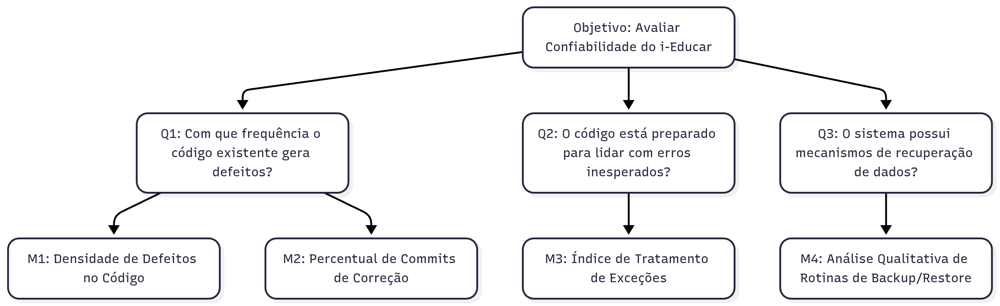

# Abordagem GQM

<!-- acho que da pra colocar um texto aqui explicando a metodologia GQM -->

## Objetivo de Medição 1: Confiabilidade

**Tabela 1** - Objetivo de Medição 1: Confiabilidade.

| **Analisar**          | o i-Educar |
|------------------------|------------|
| **Para o propósito de** | Identificar pontos do código que possam causar falhas |
| **Com respeito a**     | Confiabilidade |
| **Do ponto de vista da** | Comunidade de desenvolvedores do i-Educar |
| **No contexto da**     | Disciplina de Qualidade de Software |

---

### Perguntas e Hipóteses de Medição

**Questão 1: Maturidade**
> Com que frequência o código existente gera defeitos?

* **Hipótese 1.1 (H1.1):** Os módulos priorizados (**Escola**, **Servidores** e **Educacenso**) apresentarão uma **densidade de defeitos** (bugs reportados por KLOC) superior à de outros módulos, indicando que as áreas mais críticas do sistema são também as mais propensas a falhas.
* **Hipótese 1.2 (H1.2):** O **percentual de commits de correção** (cujas mensagens contêm termos como "fix", "bugfix", "corrige") será consistentemente alto no histórico do projeto, sugerindo que uma parcela significativa do esforço de desenvolvimento é dedicada à correção de falhas preexistentes.

**Questão 2: Tolerância a Falhas**
> O código está preparado para lidar com erros inesperados durante a execução?

* **Hipótese 2.1 (H2.1):** Uma análise por amostragem revelará um baixo **índice de tratamento de exceções** (`try-catch`) em operações críticas, como conexões com banco de dados e manipulação de arquivos, indicando uma fragilidade na defesa contra erros em tempo de execução.

**Questão 3: Recuperabilidade**
> O sistema possui mecanismos de recuperação de dados que um desenvolvedor possa verificar e manter?

* **Hipótese 3.1 (H3.1):** A **análise qualitativa das rotinas de backup** mostrará que o código é pouco documentado e de difícil compreensão, tornando a manutenção e validação desses mecanismos um processo de alto risco para os desenvolvedores da comunidade.

---

### Seleção das Métricas

**Questão 1: Maturidade**

* **Métrica 1.1: Densidade de Defeitos no Código**
    * **Definição:** Número de *issues* com a label `bug` no repositório GitHub, normalizado por mil linhas de código (KLOC).
    * **Fórmula:** `(Número total de issues "bug") / (Total de linhas de código / 1000)`
    * **Coleta:** Análise do repositório GitHub para contagem de *issues*; utilização de uma ferramenta como `cloc` para contar as linhas de código.
    * **Propósito:** Identificar quais partes do sistema são mais propensas a erros.

* **Métrica 1.2: Análise de Commits de Correção**

    * **Definição:** Percentual de *commits* cuja mensagem contém palavras-chave como "fix", "corrige" ou "bugfix".
    * **Fórmula:** `(Número de commits de correção / Número total de commits) * 100`
    * **Coleta:** Análise do histórico de *logs* do Git (`git log`).
    * **Propósito:** Avaliar se o esforço de desenvolvimento é mais reativo (corrigindo falhas) do que proativo.

**Questão 2: Tolerância a Falhas**

* **Métrica 2.1: Índice de Tratamento de Exceções**

    * **Definição:** Verificação (por amostragem ou script) da presença e do uso de blocos `try-catch` em operações críticas (ex: conexões com banco de dados, manipulação de arquivos) nos módulos priorizados.
    * **Coleta:** Revisão manual de código ou uso de scripts de análise estática para buscar padrões de tratamento de exceções.
    * **Propósito:** Medir a preparação do código para lidar com erros inesperados durante a execução.

**Questão 3: Recuperabilidade**

* **Métrica 3.1: Revisão de Código de Backup/Restore**

    * **Definição:** Análise qualitativa (baseada em checklist) das rotinas de backup para verificar se são compreensíveis, bem documentadas e se seguem boas práticas.
    * **Coleta:** Inspeção manual do código-fonte das funcionalidades de backup.
    * **Propósito:** Avaliar a manutenibilidade e a confiabilidade dos mecanismos de recuperação de dados.

---

### Relação entre a Confiabilidade, Perguntas e Métricas

<!-- AQUI IRIAM OS OUTROS OBJETIVOS DE MEDIÇÃO (MANUTENIBILIDADE E SEGURANÇA) COM SUAS RESPECTIVAS TABELAS, PERGUNTAS, HIPÓTESES, MÉTRICAS E DIAGRAMAS

pensei que esse próximo tópico poderia ser o mesmo para os 3 objetivos de medição, já que a gente vai usar os mesmos níveis de pontuação e critérios de julgamento para todos, então ele fica no final -->

## Níveis de Pontuação e Critérios de Julgamento

Para cada métrica definida por meio da abordagem GQM, foram estabelecidos níveis de pontuação que permitem interpretar os resultados de maneira padronizada, facilitando comparações e decisões. Esses níveis foram definidos com base em referências da literatura, benchmarks de ferramentas de análise estática e boas práticas de engenharia de software.

A seguir, apresenta-se a escala de pontuação definida pela equipe:

| Desempenho da Métrica | Pontuação | Interpretação Qualitativa |
| :--- | :---: | :--- |
| **Excelente** | 9 - 10 | Atende ou supera as expectativas de qualidade. Indica um código saudável e alinhado às boas práticas. |
| **Bom** | 7 - 8 | Atende de forma satisfatória, com pequenas e pontuais oportunidades de melhoria. |
| **Regular** | 4 - 6 | Apresenta deficiências perceptíveis que podem indicar débito técnico ou risco moderado. |
| **Insatisfatório** | 1 - 3 | Compromete significativamente a característica de qualidade, exigindo atenção e provável refatoração. |

### Critérios para Julgamento

Com base nas métricas e nos níveis de pontuação definidos, foram estabelecidos critérios de julgamento para interpretar os resultados da avaliação e apoiar a tomada de decisões. Os critérios são organizados por característica e baseiam-se na média de desempenho das métricas associadas a cada uma delas.

#### Critérios para Confiabilidade
* **Aceitável:** ≥ 70% das métricas classificadas como "Bom" ou "Excelente". O sistema demonstra robustez e previsibilidade.
* **Parcialmente aceitável:** Entre 40% e 69% das métricas com nível "Regular" ou superior. O sistema funciona, mas pode apresentar instabilidades pontuais.
* **Inaceitável:** > 30% das métricas atingindo o nível "Insatisfatório". A estabilidade do sistema é considerada crítica e propensa a falhas.

#### Critérios para Manutenibilidade
* **Aceitável:** ≥ 70% das métricas classificadas como "Bom" ou "Excelente". O código é considerado claro, organizado e com baixo custo de manutenção.
* **Parcialmente aceitável:** Entre 40% e 69% das métricas com nível "Regular" ou superior. A manutenção é possível, mas com esforço considerável devido ao débito técnico.
* **Inaceitável:** > 30% das métricas atingindo o nível "Insatisfatório". O código é de difícil compreensão e modificação, desestimulando novas contribuições.

#### Critérios para Segurança
* **Aceitável:** ≥ 70% das métricas classificadas como "Bom" ou "Excelente". O sistema adere às boas práticas de codificação segura.
* **Parcialmente aceitável:** Entre 40% e 69% das métricas com nível "Regular" ou superior. Foram identificadas vulnerabilidades de baixo ou médio risco.
* **Inaceitável:** > 30% das métricas atingindo o nível "Insatisfatório". Existem vulnerabilidades críticas que comprometem a integridade ou a confidencialidade dos dados.
