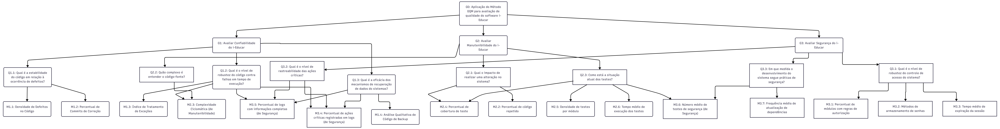

## Análise Integrada e Diagrama Geral

A avaliação de qualidade de software raramente se restringe a características isoladas. As características definidas na ISO 25010, como Confiabilidade, Manutenibilidade e Segurança, são interdependentes. Uma melhoria em uma pode fortalecer outra, enquanto uma fraqueza em uma pode ser a causa-raiz de um problema em outra.

Esta página apresenta o diagrama GQM geral do projeto, consolidando os planos de medição das três características priorizadas. Mais importante, ela fornece uma análise das **sinergias** — as conexões onde métricas de uma característica ajudam a responder perguntas de outra, permitindo uma visão holística e profunda da qualidade do i-Educar.

## Diagrama GQM Integrado

O diagrama abaixo ilustra a decomposição GQM para Confiabilidade (G1), Manutenibilidade (G2) e Segurança (G3), destacando as conexões entre os planos.

-----

## Análise das Sinergias

A verdadeira força desta avaliação GQM está nas conexões entre os planos. Elas revelam como a qualidade de uma característica é, muitas vezes, dependente de outra.

### 1\. Sinergia: Logs de Segurança $\to$ Robustez e Recuperabilidade (Confiabilidade)

  * **Conexão:** As métricas `M3.4` (Logs de Ações Críticas) e `M3.5` (Logs Completos) são essenciais para responder às questões `Q1.2` (Robustez) e `Q1.3` (Recuperabilidade).
  * **Motivação (Por quê?):** A Confiabilidade não se resume a *evitar* falhas; ela também mede a capacidade do sistema de *lidar* com falhas (Tolerância a Falhas) e se *recuperar* delas (Recuperabilidade). No contexto de um desenvolvedor, quando uma falha inesperada ocorre, a primeira (e muitas vezes única) ferramenta de diagnóstico são os logs do sistema.
  * **Implicação:** Se as métricas de Segurança (`M3.4`, `M3.5`) forem "Insatisfatórias", a capacidade do sistema de ser robusto (`Q1.2`) e recuperável (`Q1.3`) é, na prática, quase nula, independentemente de outras métricas. Um problema de Confiabilidade pode ter sua causa-raiz em uma falha de Segurança (monitoramento).

### 2\. Sinergia: Complexidade (Manutenibilidade) $\to$ Robustez (Confiabilidade)

  * **Conexão:** A métrica `M2.3` (Complexidade Ciclomática) tem um impacto direto na questão `Q1.2` (Robustez).
  * **Motivação (Por quê?):** A "robustez" (`Q1.2`) é frequentemente medida pela capacidade do código de lidar com entradas inesperadas ou falhas de I/O, o que é feito via tratamento de exceções (`M1.3`). No entanto, código com alta Complexidade Ciclomática (`M2.3` \> 10) possui muitos caminhos de execução.
  * **Implicação:** É exponencialmente mais difícil garantir que *todos* os caminhos de um método complexo tenham o tratamento de exceção adequado. Uma alta complexidade lógica (Manutenibilidade) quase sempre leva a uma baixa robustez (Confiabilidade), pois caminhos de erro são esquecidos.

### 3\. Sinergia: Testes de Segurança (Segurança) $\to$ Situação dos Testes (Manutenibilidade)

  * **Conexão:** A métrica `M3.6` (Número médio de testes de segurança) é fundamental para responder à questão `Q2.3` (Como está a situação atual dos testes?).
  * **Motivação (Por quê?):** A questão `Q2.3` (Manutenibilidade) avalia a qualidade da suíte de testes. Uma métrica isolada como `M2.4` (Cobertura de Teste) pode ser enganosa — um projeto pode ter 90% de cobertura de linha e ainda assim não testar nenhuma vulnerabilidade de segurança.
  * **Implicação:** A "situação dos testes" (`Q2.3`) só é compreendida quando combinamos métricas de volume/cobertura (`M2.4`, `M2.5`) com métricas de escopo (`M3.6`). Esta conexão expõe potenciais "pontos cegos": a suíte de testes pode ser boa para lógica de negócio (Manutenibilidade), mas péssima para Segurança.

### Conclusão da Análise

Este modelo GQM integrado demonstra que as características de qualidade não são silos. A análise cruzada permite identificar causas-raiz (ex: um problema de **Confiabilidade** pode ser causado por alta **Manutenibilidade**) e otimizar esforços (ex: melhorar os logs de **Segurança** beneficia diretamente a **Confiabilidade**).