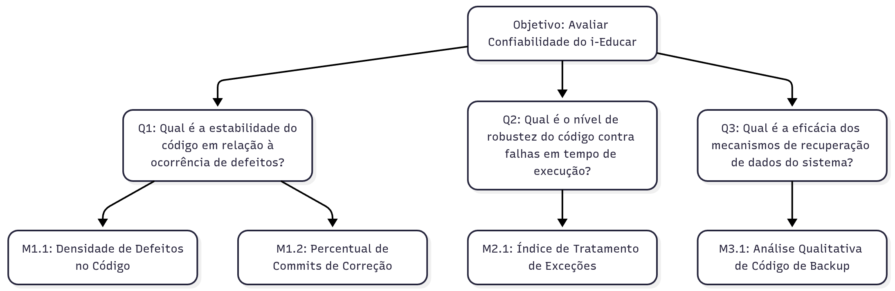

## Objetivo de Medição 1: Confiabilidade

  <table border="1" cellspacing="0" cellpadding="8" style="border-collapse: collapse; text-align: left;">
    <tr>
      <th><b>Analisar</b></th>
      <td>o i-Educar</td>
    </tr>
    <tr>
      <th><b>Para o propósito de</b></th>
      <td>Avaliar</td>
    </tr>
    <tr>
      <th><b>Com respeito a</b></th>
      <td>Confiabilidade</td>
    </tr>
    <tr>
      <th><b>Do ponto de vista da</b></th>
      <td>Comunidade de desenvolvedores</td>
    </tr>
    <tr>
      <th><b>No contexto da</b></th>
      <td>Disciplina de Qualidade de Software 1 (FCTE - UnB)</td>
    </tr>
  </table>

  <figcaption>Tabela 1: Objetivo de Medição: Confiabilidade</figcaption>

---

### Perguntas e Hipóteses de Medição

Para decompor o objetivo de análise da Confiabilidade, foram formuladas as seguintes perguntas e hipóteses. As hipóteses tornam explícito o conhecimento atual sobre o sistema, que será validado pelas métricas.

**Questão 1: Maturidade**
<!--  Antiga pergunta
a professora nao gostou da palavra frequencia e existente> 
Com que frequência o código existente gera defeitos?
 -->

> Qual é a estabilidade do código em relação à ocorrência de defeitos?

* **Hipótese 1.1 (H1.1):** Os módulos de maior importância para o negócio (**Escola**, **Servidores** e **Educacenso**) apresentarão uma **densidade de defeitos** (bugs por KLOC) pelo menos 20% superior à média dos demais módulos do sistema.

* **Hipótese 1.2 (H1.2):** O **percentual de commits de correção** no histórico do projeto será superior a 15%, indicando que uma parcela significativa do esforço de desenvolvimento é reativa, focada na correção de falhas existentes.

**Questão 2: Tolerância a Falhas**
<!--  Antiga pergunta
A professora nao falou sobre essa pergunta
O código está preparado para lidar com erros inesperados durante a execução?
 -->
> Qual é o nível de robustez do código contra falhas em tempo de execução?

* **Hipótese 2.1 (H2.1):** Menos de 50% das operações críticas de entrada/saída (I/O), como conexões com banco de dados e manipulação de arquivos nos módulos priorizados, possuirão um mecanismo adequado de tratamento de exceções (try-catch).

**Questão 3: Recuperabilidade**
<!--  Antiga pergunta
A professora achou que tinha muita coisa
> O sistema possui mecanismos de recuperação de dados que um desenvolvedor possa verificar e manter?
 -->

> Qual é a eficácia dos mecanismos de recuperação de dados do sistema?

* **Hipótese 3.1 (H3.1):** A **análise qualitativa das rotinas de backup** revelará uma baixa pontuação de manutenibilidade (inferior a 5 em 10), devido à falta de documentação clara e à complexidade do código, representando um risco para a manutenção desses mecanismos.

---

### Seleção das Métricas

**Questão 1: Maturidade**

* **Métrica 1.1: Densidade de Defeitos no Código**
    * **Definição:** Número de *issues* com a label `bug` no repositório GitHub, normalizado por mil linhas de código (KLOC).
    * **Fórmula:** `(Número total de issues "bug") / (Total de linhas de código / 1000)`
    * **Coleta:** 
        1. Listar todas as issues com a label `bug` via API do GitHub ou busca manual.
        2. Contar as linhas de código PHP (`.php`) para os módulos priorizados (Escola, Servidores, Educacenso) e para o restante do sistema separadamente, utilizando a ferramenta `cloc`.
        3. Aplicar a fórmula para os dois escopos (prioritários vs. não prioritários) e comparar os resultados para validar a **H1.1**.
    * **Pontuação de Julgamento:** 

        | **Excelente** | **Bom** | **Regular** | **Insatisfatório** |
        |:--------------:|:--------:|:-------------:|:-------------------:|
        | ≤ 1 bug/KLOC | >1 e ≤3 bugs/KLOC | >3 e ≤6 bugs/KLOC | >6 bugs/KLOC |

    * **Propósito:** Identificar se as áreas mais críticas do sistema são também as que concentram mais defeitos reportados.

* **Métrica 1.2: Percentual de Commits de Correção**

    * **Definição:** Percentual de **commits** cuja mensagem contém palavras-chave como "fix", "corrige" ou "bugfix".
    * **Fórmula:** `(Número de commits de correção / Número total de commits) * 100`
    * **Coleta:**
        1. Definir um período de análise (ex: últimos 24 meses).
        2. Contar o número total de commits com `git log --oneline --no-merges | wc -l`
        3. Contar o número de commits de correção com `git log --grep="..." --regexp-ignore-case --oneline --no-merges | wc -l`
        4. Aplicar a fórmula para validar a **H1.2**.

    * **Pontuação de Julgamento:** 

        | **Excelente** | **Bom** | **Regular** | **Insatisfatório** |
        |:--------------:|:--------:|:-------------:|:-------------------:|
        | ≤ 10% | >10% e ≤20% | >20% e ≤35% | >35% |

    * **Propósito:** Avaliar se o esforço de desenvolvimento é mais reativo (corrigindo falhas) do que proativo (desenvolvendo novas funcionalidades).

**Questão 2: Tolerância a Falhas**

* **Métrica 2.1: Índice de Tratamento de Exceções**

    * **Definição:** Percentual de operações de I/O críticas que estão contidas dentro de um bloco de tratamento de exceções (`try-catch`).
    * **Fórmula:** `(Número de operações críticas com try-catch / Número total de operações críticas) * 100`
    * **Coleta:** Revisão manual de código ou uso de scripts de análise estática para buscar padrões de tratamento de exceções.
        1. Definir a lista de "operações críticas": chamadas de função/método para conexão com banco de dados ex:( `new PDO(`, `pg_connect`), manipulação de arquivos (ex: `fopen`, `file_put_contents`) etc.
        2. Nos diretórios dos módulos priorizados, executar scripts de busca (`grep` ou `ack`) para contar o número total de ocorrências dessas operações.
        3. Executar um segundo script para contar quantas dessas ocorrências estão sintaticamente dentro de um bloco `try { ... }`.
        4. Aplicar a fórmula para validar a **H2.1**.
    * **Observação:** a métrica mede a existência do mecanismo, não sua eficácia.
        
    * **Pontuação de Julgamento:** 

        | **Excelente** | **Bom** | **Regular** | **Insatisfatório** |
        |:--------------:|:--------:|:-------------:|:-------------------:|
        | ≥ 90% | 70%–89% | 40%–69% | < 40% |

    * **Propósito:** Medir a robustez do código contra erros em tempo de execução.

**Questão 3: Recuperabilidade**

* **Métrica 3.1: Análise Qualitativa de Código de Backup**

    * **Definição:** Avaliação qualitativa, baseada em um checklist estruturado, das rotinas de backup para verificar sua compreensibilidade, documentação e aderência a boas práticas.
    * **Coleta:** Inspeção manual do código-fonte das funcionalidades de backup.
        1. Identificar os arquivos/módulos responsáveis pela funcionalidade de backup/restauração no código-fonte.
        2. Realizar uma inspeção manual do código aplicando o checklist abaixo. Cada item recebe uma nota de 0 (ausente) a 2 (excelente).
        3. Checklist de Análise:
            * **Documentação (Comentários):** O código possui comentários explicando a lóǵica geral e os passos críticos?
            * **Clareza do Código:** Os nomes de variáveis e funções são intuitivos e seguem um padrão?
            * **Tratamento de Erros:** O código verifica falhas potenciais (ex: falha de escrita em disco, permissões) e as reporta de forma adequada?
            * **Configuração:** As configurações críticas (ex: caminhos de backup, credenciais) são externalizadas e não "hard-coded"?
            * **Testabilidade:** A estrutura do código permite a criação de testes unitários ou de integração?
        4. A pontuação final (0 a 10) será a soma dos pontos do checklist, usada para validar a **H3.1**.

    * **Pontuação de Julgamento:** 

        | **Excelente** | **Bom** | **Regular** | **Insatisfatório** |
        |:--------------:|:--------:|:-------------:|:-------------------:|
        | 9–10 | 7–8 | 4–6 | 0–3 |

    * **Propósito:** Avaliar a manutenibilidade e a confiabilidade percebida dos mecanismos de recuperação de dados do ponto de vista de um desenvolvedor.

### Critérios para Julgamento

* **Aceitável:** ≥ 70% das métricas classificadas como "Bom" ou "Excelente". O sistema demonstra robustez e previsibilidade.
* **Parcialmente aceitável:** Entre 40% e 69% das métricas com nível "Regular" ou superior. O sistema funciona, mas pode apresentar instabilidades pontuais.
* **Inaceitável:** > 30% das métricas atingindo o nível "Insatisfatório". A estabilidade do sistema é considerada crítica e propensa a falhas.

---

### Relação entre a Confiabilidade, Perguntas e Métricas

  <table border="1" cellspacing="0" cellpadding="8" style="border-collapse: collapse; text-align: left;">
    <tr>
      <th><b>Questão</b></th>
      <th><b>Métricas Simplificadas</b></th>
      <th><b>Tipo de Coleta</b></th>
    </tr>
    <tr>
      <td><b>Maturidade</b> Qual é a estabilidade do código em relação a defeitos?</td>
      <td>
        - Densidade de defeitos (issues "bug" por KLOC) 
        - Percentual de commits de correção (mensagens com fix/corrige/bugfix)
      </td>
      <td>
        - GitHub issues + contagem de linhas com cloc (ou similar) 
        - Histórico de commits via git log com filtros/regex
      </td>
    </tr>
    <tr>
      <td><b>Tolerância a Falhas</b> Qual é o nível de robustez contra falhas em tempo de execução?</td>
      <td>
        - Índice de tratamento de exceções (% operações I/O críticas dentro de try-catch)
      </td>
      <td>
        - Análise estática / scripts (grep/ack) para localizar operações críticas e verificar blocos try-catch 
        - Revisão manual de trechos críticos quando necessário
      </td>
    </tr>
    <tr>
      <td><b>Recuperabilidade</b> Qual é a eficácia dos mecanismos de recuperação de dados?</td>
      <td>
        - Pontuação qualitativa das rotinas de backup (checklist, escala 0–10)
      </td>
      <td>
        - Inspeção manual do código e documentação aplicando checklist de avaliação (documentação, clareza, tratamento de erros, configuração, testabilidade)
      </td>
    </tr>
  </table>

  

    <figcaption>Tabela 2: Questões e Métricas Simplificadas</figcaption>
  

---

### Diagrama GQM - Confiabilidade (Representação Estrutural)

  <figcaption>Figura 2: Diagrama GQM - Confiabilidade. Autor: <a href="http://github.com/manuvaladares">Manuela Valadares</a></figcaption>

