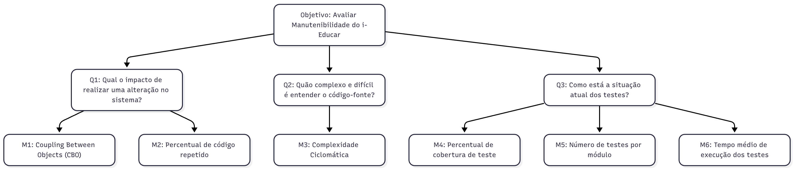

# Fase 2 - Especificar a Avaliação da Qualidade

## Objetivo de Negócio do i-Educar

Garantir a Evolução Contínua e Sustentável do sistema i-Educar, com foco em melhorar a manutenibilidade do código-fonte, reduzindo o esforço, o custo e o risco associados à realização de novas funcionalidades e correções de bugs pela equipe de desenvolvimento.

## Objetivo de Medição 2: Manutenibilidade do i-Educar

O objetivo de medição está definido conforme o template GQM (Goal-Question-Metric):

| Elemento | Descrição |
|----------|-----------|
| Analisar | i-Educar |
| Propósito | Avaliar |
| Respeito a | Manutenibilidade |
| Ponto de Vista | Equipe de desenvolvimento |
| Contexto | Disciplina de Qualidade de Software 1 |

  <figcaption>Tabela 2: Objetivo de Medição: Manutenibilidade</figcaption>

## Perguntas, Hipóteses e Métricas

Este objetivo se desdobra em três perguntas chave, cada uma abordando um aspecto crítico da manutenibilidade.

### Pergunta 1: Qual o impacto de realizar uma alteração no sistema?

| Item | Descrição |
|------|-----------|
| **Hipótese** | Códigos com alto acoplamento e baixa coesão podem causar efeitos colaterais inesperados com mudanças realizadas. |
| **Foco** | Acoplamento e Reuso de Código (Duplicação) |

| Métrica (M) | Critérios de Avaliação (Exemplo) |
|-------------|----------------------------------|
| **M1: Coupling Between Objects (CBO)** | ✅ **Bom:** CBO ≤ 10 ⚠️ **Aceitável:** 10 < CBO ≤ 15 ❌ **Crítico:** CBO > 15 |
| **M2: Percentual de Código Repetido** | ✅ **Bom:** M2 ≤ 3% ⚠️ **Aceitável:** 3% < M2 ≤ 5% ❌ **Crítico:** M2 > 5% |

### Pergunta 2: Quão complexo é entender o código-fonte do i-Educar?

| Item | Descrição |
|------|-----------|
| **Hipótese** | Um código complexo aumenta o tempo necessário para um desenvolvedor entender onde e como realizar uma alteração. |
| **Foco** | Complexidade Estrutural |

| Métrica (M) | Critérios de Avaliação (Exemplo) |
|-------------|----------------------------------|
| **M3: Complexidade Ciclomática (CC) por função** | ✅ **Bom:** CC ≤ 5 ⚠️ **Aceitável:** 5 < CC ≤ 10 ❌ **Crítico:** CC > 10 |

### Pergunta 3: Como está a situação atual dos testes do i-Educar?

| Item | Descrição |
|------|-----------|
| **Hipótese** | Códigos com baixa testabilidade possuem mais probabilidade de apresentar erros em produção. |
| **Foco** | Cobertura e Eficiência dos Testes |

| Métrica (M) | Critérios de Avaliação (Exemplo) |
|-------------|----------------------------------|
| **M4: Percentual de Cobertura de Teste** | ✅ **Bom:** M4 ≥ 80% ⚠️ **Aceitável:** 70% ≤ M4 < 80% ❌ **Crítico:** M4 < 70% |
| **M5: Número de Testes por Módulo** | Esta métrica deve ser avaliada em relação à criticidade e tamanho do módulo. |
| **M6: Tempo Médio de Execução dos Testes** | ✅ **Bom:** M6 ≤ 1s ⚠️ **Aceitável:** 1s < M6 ≤ 3s ❌ **Crítico:** M6 > 3s |

## Folha de Abstração

| Campo | Detalhamento para o i-Educar |
|-------|------------------------------|
| **Objeto** | Código-fonte do sistema i-Educar, histórico de desenvolvimento (commits, branches), e base de testes automatizados. |
| **Propósito** | Avaliar o quão eficiente e segura é a manutenção do sistema i-Educar. |
| **Ponto de Vista** | Equipe de Desenvolvimento (incluindo novos membros) – capacidade de realizar modificações, correções e expansões com autonomia e baixo risco. |
| **Foco da Qualidade** | **Modularidade (Q1):** M1 (CBO), M2 (Duplicação) **Legibilidade (Q2):** M3 (Complexidade Ciclomática) **Testabilidade (Q3):** M4 (Cobertura), M5 (Testes por módulo), M6 (Tempo de execução) |
| **Hipóteses de Referência** | • Uma redução de 50% nas linhas de código repetido (M2) reduzirá o tempo de manutenção de código legado em 15%. • Manter a Complexidade Ciclomática (M3) abaixo de 10 reduzirá em 40% a dificuldade de onboarding de novos desenvolvedores. • Aumentar a Cobertura de Teste (M4) para acima de 80% diminuirá o número de defeitos críticos em produção em 20%. |
| **Fatores de Variação** | - Linguagens de programação utilizadas e suas ferramentas de métricas. - Experiência da equipe com o código legado. - Frequência e qualidade das revisões de código (Code Reviews). - Políticas de refatoração do projeto. |

## Diagrama GQM (Representação Estrutural)

  <figcaption>Figura 3: Diagrama GQM. Autor: <a href="http://github.com/andre-maia51">André Maia</figcaption>

