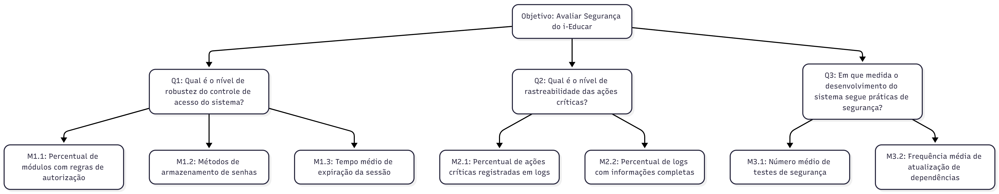

## Objetivo de Medição 3 - Segurança

  <table border="1" cellspacing="0" cellpadding="8" style="border-collapse: collapse; text-align: left;">
    <tr>
      <th><b>Analisar</b></th>
      <td>o i-Educar</td>
    </tr>
    <tr>
      <th><b>Para o propósito de</b></th>
      <td>Avaliar</td>
    </tr>
    <tr>
      <th><b>Com respeito a</b></th>
      <td>Segurança</td>
    </tr>
    <tr>
      <th><b>Do ponto de vista da</b></th>
      <td>Equipe de desenvolvimento</td>
    </tr>
    <tr>
      <th><b>No contexto da</b></th>
      <td>Disciplina de Qualidade de Software 1 (FCTE - UnB)</td>
    </tr>
  </table>

  

    <figcaption>Tabela 5: Objetivo de Medição: Segurança</figcaption>
  

---

### Perguntas e Hipóteses de Medição

**Questão 1: Mecanismos de Autenticação e Autorização**

>  Qual é o nível de robustez do controle de acesso do sistema?

* **Hipótese 1.1 (H1.1):** Módulos com dados sensíveis terão pelo menos uma regra de autorização aplicada para cada papel de usuário.
* **Hipótese 1.2 (H1.2):** As senhas são armazenadas de com hashing e criptografia.  
* **Hipótese 1.3 (H1.3):** Sessões de usuários são encerradas automaticamente após 60 minutos de inatividade.

**Questão 2: Monitoramento e Auditoria**

> Qual é o nível de rastreabilidade das ações críticas?

* **Hipótese 2.1 (H2.1):** Pelo menos 70% das ações críticas (login, exclusão, alteração de dados) são registradas em logs.
* **Hipótese 2.2 (H2.2):** Mais de 60% dos logs incluem usuário, ação e data/hora. 

**Questão 3: Desenvolvimento Seguro**

> Em que medida o desenvolvimento do sistema segue práticas de segurança?

* **Hipótese 3.1 (H3.1):** Pelo menos três casos de teste de segurança existem para cada módulo principal.
* **Hipótese 3.2 (H3.2):** Dependências externas são atualizadas pelo menos uma vez a cada 6 meses.
* **Hipótese 3.3 (H3.3):** Ferramentas de análise estática são executadas pelo menos antes de cada release.

---

### Seleção das Métricas

**Questão 1: Mecanismos de Autenticação e Autorização**

* **Métrica 1.1 – Percentual de módulos com regras de autorização**  
    * **Definição:** Percentual de módulos que possuem pelo menos uma regra de autorização aplicada para cada papel de usuário identificado.  
    * **Coleta:** Revisão do código fonte e documentação para identificar regras de autorização por módulo.  
    * **Pontuação de Julgamento:**  

      | **Excelente** | **Bom** | **Regular** | **Insatisfatório** |
      |:-------------:|:-------:|:-----------:|:-----------------:|
      | ≥ 90%         | 70% a 89% | 40% a 69% | < 40%             |

    * **Propósito:** Avaliar a abrangência do controle de acesso baseado em papéis.  

* **Métrica 1.2 – Método de armazenamento de senhas**  
    * **Definição:** Verificação da presença de técnicas de hashing e criptografia no armazenamento das senhas.  
    * **Coleta:** Análise do código fonte do sistema de autenticação.  
    * **Pontuação de Julgamento:**  

      | **Conforme** | **Não conforme** |
      |:------------:|:----------------:|
      | Sim          | Não              |

    * **Propósito:** Confirmar a segurança no armazenamento de credenciais.  

* **Métrica 1.3 – Tempo médio de expiração da sessão**  
    * **Definição:** Tempo configurado para encerramento automático das sessões por inatividade, em minutos.  
    * **Coleta:** Análise das configurações do sistema ou testes funcionais para medir o tempo de expiração.  
    * **Pontuação de Julgamento:**  

      | **Conforme** | **Não conforme** |
      |:------------:|:----------------:|
      | Menor ou igual a 60 | Acima de 60 |

    * **Propósito:** Verificar conformidade com a política de segurança de sessões.  

**Questão 2: Monitoramento e Auditoria**

* **Métrica 2.1 – Percentual de ações críticas registradas em logs**  
    * **Definição:** Percentual de eventos críticos (login, exclusão, alteração) que são registrados em logs.  
    * **Coleta:** Análise dos arquivos de log e documentação do sistema.  
    * **Pontuação de Julgamento:**  

      | **Excelente** | **Bom** | **Regular** | **Insatisfatório** |
      |:-------------:|:-------:|:-----------:|:-----------------:|
      | ≥ 90%         | 70% a 89% | 40% a 69% | < 40%             |

    * **Propósito:** Avaliar a efetividade do monitoramento de eventos de segurança.  

* **Métrica 2.2 – Percentual de logs com informações completas**  
    * **Definição:** Percentual de registros de log que incluem usuário, ação e data/hora.  
    * **Coleta:** Amostragem e análise dos registros de log.  
    * **Pontuação de Julgamento:**  

      | **Excelente** | **Bom** | **Regular** | **Insatisfatório** |
      |:-------------:|:-------:|:-----------:|:-----------------:|
      | ≥ 80%         | 60% a 79% | 40% a 59% | < 40%             |

    * **Propósito:** Garantir a rastreabilidade adequada dos eventos registrados.  

**Questão 3: Desenvolvimento Seguro**

* **Métrica 3.1 – Número médio de testes de segurança por módulo principal**  
    * **Definição:** Quantidade média de casos de teste relacionados à segurança para cada módulo principal do sistema.  
    * **Coleta:** Inspeção do repositório de testes automatizados e documentação.  
    * **Pontuação de Julgamento:**  

      | **Excelente** | **Bom** | **Regular** | **Insatisfatório** |
      |:-------------:|:-------:|:-----------:|:-----------------:|
      | ≥ 3           | 2       | 1           | 0                 |

    * **Propósito:** Avaliar a cobertura dos testes de segurança no projeto.  

* **Métrica 3.2 – Frequência média de atualização de dependências**  
    * **Definição:** Intervalo médio, em meses, entre atualizações das dependências externas do projeto.  
    * **Coleta:** Análise do histórico de commits e arquivos de configuração de dependências.  
    * **Pontuação de Julgamento:**  

      | **Conforme** | **Não conforme** |
      |:------------:|:----------------:|
      | Atualização a cada ≤ 6 meses | Atualização > 6 meses |

    * **Propósito:** Verificar a manutenção do projeto em relação a vulnerabilidades conhecidas.  

---

### Critérios de Julgamento para Segurança

* **Aceitável:** ≥ 70% das métricas classificadas como "Bom" ou "Excelente". O sistema adere às boas práticas de codificação segura.
* **Parcialmente aceitável:** Entre 40% e 69% das métricas com nível "Regular" ou superior. Foram identificadas vulnerabilidades de baixo ou médio risco.
* **Inaceitável:** > 30% das métricas atingindo o nível "Insatisfatório". Existem vulnerabilidades críticas que comprometem a integridade ou a confidencialidade dos dados.

---

### Relação entre a Segurança, Perguntas e Métricas

  <table border="1" cellspacing="0" cellpadding="8" style="border-collapse: collapse; text-align: left;">
    <tr>
      <th><b>Questão</b></th>
      <th><b>Métricas Simplificadas</b></th>
      <th><b>Tipo de Coleta</b></th>
    </tr>
    <tr>
      <td>1 – Autenticação e Autorização</td>
      <td>Presença de autenticação; Perfis de usuário</td>
      <td>Teste manual / Análise documental</td>
    </tr>
    <tr>
      <td>2 – Monitoramento e Auditoria</td>
      <td>Existência de logs; Registro de falhas de login</td>
      <td>Teste funcional / Observação</td>
    </tr>
    <tr>
      <td>3 – Desenvolvimento Seguro</td>
      <td>Presença de testes; Frequência de atualização de dependências</td>
      <td>Inspeção do repositório / Histórico de commits</td>
    </tr>
  </table>

  

    <figcaption>Tabela 6: Questões e Métricas Simplificadas</figcaption>
  

---

### Diagrama GQM - Segurança (Representação Estrutural)

  <figcaption>Figura 4: Diagrama GQM - Segurança. Autor: <a href="http://github.com/ZenildaVieira">Zenilda Vieira</figcaption>

