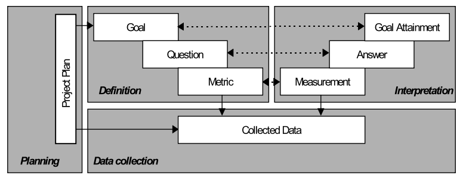

# Abordagem GQM

A metodologia GQM (Goal-Question-Metric) foi empregada para estruturar a avaliação de qualidade do software i-Educar, com foco em três características priorizadas: **Confiabilidade**, **Segurança** e **Manutenibilidade**. A seleção destas áreas foi estratégica e baseada nos desafios mais críticos do sistema:

* A **Confiabilidade** foi escolhida devido aos inúmeros relatos de profissionais da educação sobre instabilidades e falhas, que afetam a operação diária das escolas.
* A **Segurança** é mandatória, pois o sistema manipula dados pessoais e sensíveis de alunos, exigindo conformidade com a Lei Geral de Proteção de Dados (LGPD).
* A **Manutenibilidade** é fundamental para a sustentabilidade do i-Educar como um projeto de código aberto, que depende da capacidade da comunidade para corrigir problemas e evoluir o software.

A abordagem GQM garante que a avaliação de cada uma dessas características esteja alinhada a objetivos claros, transformando desafios de negócio e operacionais em um plano de medição concreto e orientado a dados. A metodologia é composta por três níveis principais:

1. **Objetivo (Goal):** Define o que se deseja alcançar, considerando o propósito, o objeto de estudo, o ponto de vista e o contexto.
2. **Perguntas (Questions):** Identificam os aspectos específicos que precisam ser avaliados para atingir o objetivo.
3. **Métricas (Metrics):** Fornecem os dados necessários para responder às perguntas, permitindo uma análise quantitativa ou qualitativa.

Essa metodologia é, portanto, essencial para analisar de forma aprofundada as características priorizadas e garantir o sucesso, a conformidade e a longevidade do sistema.

  <figcaption>Figura 1: As Quatro Fases do GQM. Autor: Basili e Weiss, 1984</figcaption>

