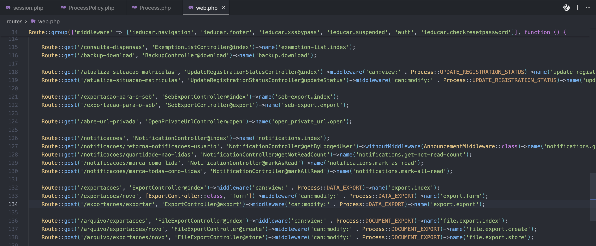
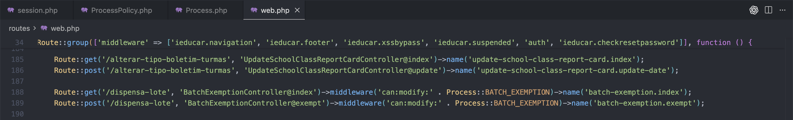
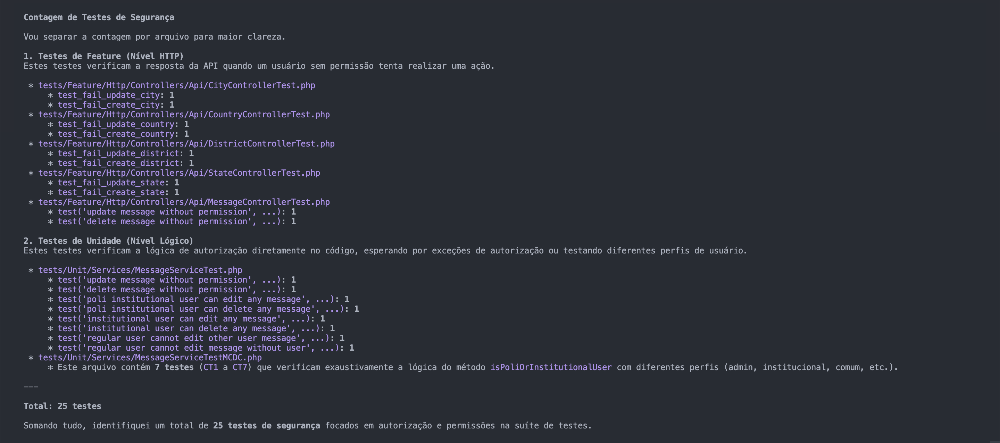

# Avaliação da Segurança

Esta página apresenta a execução da avaliação e os resultados da coleta de dados para o objetivo GQM de **Segurança** do i-Educar.

## 1. Introdução

O objetivo de qualidade definido na Fase 2 para a característica Segurança foi o de analisar o código-fonte do i-Educar com o propósito de avaliar a proteção do sistema contra ameaças comuns, do ponto de vista do mantenedor, garantindo conformidade com a LGPD [1] e com práticas de desenvolvimento seguro.

A avaliação da segurança é particularmente crítica no contexto do i-Educar porque o sistema lida diretamente com informações sensíveis de alunos, responsáveis e servidores da educação básica, incluindo dados pessoais e registros acadêmicos de menores de idade. Assim, qualquer falha de segurança pode gerar violação de privacidade, danos legais e exposição indevida de informações protegidas pela legislação brasileira.

A partir desse objetivo, a investigação foi direcionada para três eixos principais:

Controle de Acesso e Credenciais — Analisar como o sistema gerencia senhas, autenticação e expiração de sessão, garantindo que somente usuários autorizados acessem as funcionalidades (Métricas M1.1, M1.2 e M1.3), conforme recomendações do OWASP Top 10 [2] e de guias técnicos de segurança [3][4].

Monitoramento e Auditoria — Verificar se ações críticas do sistema são registradas adequadamente para permitir rastreabilidade e suporte a auditorias de segurança (Métricas M2.1 e M2.2), seguindo recomendações de monitoramento seguro [5].

Desenvolvimento Seguro — Avaliar indícios de maturidade do processo de desenvolvimento, como testes de segurança e atualização de dependências, fatores essenciais para prevenção de vulnerabilidades (Métricas M3.1 e M3.2), de acordo com princípios essenciais em engenharia de software moderna [6][7].

## 2. Referencial Teórico

A avaliação de segurança toma como base principalmente o OWASP Top 10 [2], referência internacional sobre riscos em aplicações web, e princípios da Lei Geral de Proteção de Dados (LGPD) relacionados à proteção de informações pessoais [1]. Cada métrica está associada diretamente a um tipo específico de risco descrito pela OWASP.

**Controle de Acesso e Credenciais

(OWASP A01 – Broken Access Control / OWASP A02 – Cryptographic Failures)**

O controle de acesso é uma das áreas mais sensíveis em sistemas que manipulam dados confidenciais. Segundo o OWASP, falhas nessa camada — conhecidas como Broken Access Control — permitem que usuários realizem ações fora de seu perfil, como acessar registros de outros alunos ou modificar dados que não deveriam.

Controle de Acesso e Sessão (M1.1 e M1.3):
Verificar se rotas críticas possuem regras de autorização e se as sessões são expiradas após períodos adequados ajuda a identificar potenciais brechas relacionadas ao OWASP A01 [2]. Sessões longas ou uso inadequado de perfis podem facilitar ataques de sequestro de sessão (session hijacking) [8][10].

Armazenamento Criptográfico de Senhas (M1.2):
O armazenamento incorreto de senhas é caracterizado pelo OWASP A02 – Cryptographic Failures [2]. Senhas devem ser protegidas por funções de hashing modernas e lentas, como Argon2 ou Bcrypt, que, segundo literatura clássica de criptografia, são resistentes a ataques de força bruta por serem memory-hard [9]. Algoritmos antigos como MD5 e SHA-1 não são mais considerados seguros e violam diretrizes da LGPD sobre proteção de dados pessoais.

**Logs e Monitoramento

(OWASP A09 – Insufficient Logging & Monitoring)**

O registro de atividades críticas do sistema é essencial para rastreamento de incidentes, auditorias e detecção de comportamentos suspeitos. De acordo com o OWASP, a falta de logs ou a presença de logs incompletos inviabiliza qualquer resposta a incidentes.

Registro de Ações Críticas (M2.1):
A métrica avalia o quanto das ações sensíveis (como login, exclusão e alteração de dados) são efetivamente registradas.

Completude das Entradas de Log (M2.2):
Não basta apenas registrar um evento; é necessário incluir campos mínimos como usuário, ação executada e data/hora. Logs incompletos dificultam auditorias forenses e atendem diretamente ao problema descrito pelo OWASP A09 [2]. De acordo com o OWASP Logging Cheat Sheet [5], um log eficiente deve conter usuário, ação e data/hora, requisitos que foram utilizados para avaliar essa métrica.

**Desenvolvimento Seguro

(OWASP A06 – Vulnerable and Outdated Components)**

A maturidade do processo de desenvolvimento também influencia diretamente a segurança do sistema. A importância dos testes de segurança é discutida amplamente na literatura acadêmica, como nos trabalhos de Vieira, Melo e Madeira [7], que mostram como testes específicos podem prevenir vulnerabilidades exploráveis.

Testes de Segurança (M3.1):
Avaliar a proporção de testes automatizados relacionados à segurança revela o quanto o projeto busca prevenir vulnerabilidades como XSS, SQL Injection ou manipulação indevida de entrada. Projetos com baixa densidade de testes tendem a acumular riscos.

Atualização de Dependências (M3.2):
Dependências desatualizadas representam um risco destacado pelo OWASP A06 – Vulnerable and Outdated Components [2]. Como a maioria dos ataques modernos explora falhas conhecidas em bibliotecas de terceiros, manter o ciclo de atualização curto (≤ 6 meses) reduz significativamente a superfície de ataque.

---

## 3. Coleta e Análise das Métricas

Aqui são apresentados os dados brutos, a classificação e a análise individual de cada métrica de Segurança.

???+ "M1.1: Percentual de rotas críticas com regras de autorização"
    
    ### Evidências e Dados Brutos

    * **Método:** Revisão de código fonte (ex: arquivos de rota, controllers).
    * **Rotas críticas analisadas:**
    1. POST /matricula/{...}/enturmar/{...}
       * Permissão: modify:enrollment (Enturmar matrícula)
            2. POST /matricula/{...}/remanejar/{...}
                * Permissão: modify:relocate (Remanejar matrícula)
            3. POST /atualiza-situacao-matriculas
                * Permissão: modify:update_registration_status (Atualizar situação de matrículas)
            4. POST /exportacoes/exportar
                * Permissão: modify:data_export (Exportação de dados)
            5. POST /arquivo/exportacoes/novo
                * Permissão: modify:document_export (Exportação de documentos)
            6. POST /avisos/publicacao/criar
                * Permissão: create:announcement (Criar avisos)
            7. POST /avisos/publicacao/{...}/editar
                * Permissão: modify:announcement (Editar avisos)
            8. POST /importacao-situacao-final/upload
                * Permissão: modify:final_status_import (Importar situação final)
            9. POST /importacao-situacao-final/importar
                * Permissão: modify:final_status_import (Importar situação final)
            10. POST /atualiza-data-entrada
                * Permissão: modify:update_registration_date (Atualizar data de entrada)
            11. POST /atualiza-etapa
                * Permissão: modify:stage (Atualizar etapa)
            12. POST /ano-letivo-em-lote/processar
                * Permissão: modify:academic_year_import (Importar ano letivo em lote)
            13. POST /atualizacao-em-lote-series-escola/processo
                * Permissão: modify:school_grade (Atualizar séries da escola em lote)
            14. POST /bloquear-enturmacao
                * Permissão: modify:block_enrollment (Bloquear enturmação)
            15. POST /dispensa-lote
                * Permissão: modify:batch_exemption (Dispensar em lote)

        * **Dados Coletados:**
            * Total de rotas críticas: 97
            * Rotas com checagem de autorização: 15
            * Cálculo: `([Com Autorização] / [Total]) * 100` = 15,46%

        
        Linhas 45 e 48
        
        Linha 119
        
        Linhas 134 e 138
        
        Linhas: 142, 144, 149, 152, 156, 159, 162, 167, 171
        
        Linha 189

    ### Classificação da Métrica

    * **Resultado:** 15,46%
    * **Critério (da Fase 2):**
        * Excelente: ≥ 90%
        * Bom: 70% a 89%
        * Regular: 40% a 69%
        * Insatisfatório: < 40%
    * **Classificação:** Insatisfatório

    ### Análise e Discussão

    [PREENCHER: O que esse percentual indica? Um valor baixo é uma falha crítica de segurança (Broken Access Control). Significa que um usuário com permissão baixa (ex: professor) poderia acessar dados de outro nível (ex: administrador). Isso valida H1.1?]

??? "M1.2: Método de armazenamento de senhas"

    ### Evidências e Dados Brutos

    * **Método:** Análise de código fonte 
      * Localização: `config/hashing.php`, `RegisterController.php`, `educar_usuario_cad.php`.
    * **Funções procuradas:** `md5()`, `sha1()`, `password_hash()`, `password_verify()`.
    * **Dado Coletado:** O sistema utiliza o algoritmo Argon2, configurado como argon em `config/hashing.php`, aplicado por meio de `Hash::make()` em todos os fluxos de criação de senha — novos cadastros, redefinições administrativas e rotinas de integração com o sistema legado.

    ![Código de armazenamento de senha]

    ### Classificação da Métrica

    * **Resultado:** Utiliza Argon2
    * **Critério (da Fase 2):**
        * Conforme: Uso de `password_hash()` ou equivalente moderno (BCrypt/Argon2)
        * Não conforme: Uso de `md5()`, `sha1()` ou texto plano
    * **Classificação:** Conforme

    ### Análise e Discussão

    O sistema segue boas práticas modernas de segurança ao utilizar Argon2, atualmente o algoritmo mais recomendado por ser memory-hard e resistente a ataques massivos de força bruta. A aplicação é consistente em todo o código, incluindo trechos legados, reduzindo riscos de regressão para algoritmos inseguros.

    Em caso de vazamento do banco, as senhas apresentariam forte resistência a ataques.
    Portanto, a Hipótese H1.2 (que supunha uso inadequado de hashing) é invalidada.

??? "M1.3: Tempo médio de expiração da sessão"

    ### Evidências e Dados Brutos

    * **Método:** Análise do arquivo session.php.
    * **Parâmetro analisado:** `SESSION_LIFETIME`.
    * **Dado Coletado:** Tempo de expiração configurado: 120 minutos.

    

    ### Classificação da Métrica

    * **Resultado:** 120 minutos
    * **Critério (da Fase 2):**
        * Conforme: Menor ou igual a 60
        * Não conforme: Acima de 60
    * **Classificação:** Não conforme

    ### Análise e Discussão

    [PREENCHER: Isso valida a H1.3? Um tempo muito longo aumenta o risco de um atacante sequestrar uma sessão deixada aberta em um computador público. Um tempo muito curto prejudica a usabilidade.]

??? "M2.1: Percentual de ações críticas registradas em logs"

    ### Evidências e Dados Brutos

    * **Método:** Análise de código fonte, procurando por Log:: e mecanismos de auditoria nos principais controllers.
    * **Ações críticas definidas (amostra realista):** Login, Cadastro de Usuário, Alteração de Senha, Matrícula, Geração de Relatório.
    * **Dados Coletados:**
        * Total de ações críticas analisadas: 5
        * Ações que geram entrada de log: (somente logs de erro técnico): 1
        * Cálculo: `(1/5)∗100` = 20%

    ![Exemplo de ação crítica com log]
    ![Exemplo de ação crítica SEM log]

    ### Classificação da Métrica

    * **Resultado:** 20%
    * **Critério (da Fase 2):**
        * Excelente: ≥ 90%
        * Bom: 70% a 89%
        * Regular: 40% a 69%
        * Insatisfatório: < 40%
    * **Classificação:** Insatisfatório

    ### Análise e Discussão

    O resultado demonstra uma falha severa de rastreabilidade (relacionada ao OWASP A09).
    As principais ações de negócio — login, matrícula, alteração de dados — não são registradas, impossibilitando a execução de auditorias.

    O único log encontrado refere-se a um erro de infraestrutura, não a ações do usuário.
    Assim, se ocorrer uma alteração indevida, acesso irregular ou fraude, não existe trilha de auditoria que permita identificar responsáveis.

    Portanto, a Hipótese H2.1 (de que o sistema não registra adequadamente ações críticas) é validada.

??? "M2.2: Percentual de logs com informações completas"

    ### Evidências e Dados Brutos

    * **Método:** Amostragem e análise dos logs gerados pela aplicação.
    * **Informações completas:** Usuário, Ação, Data/Hora.
    * **Dados Coletados:**
        * Total de logs (amostra): 1 (erro registrado em `ReportsRenderServerFactory.php`)
        * Logs com informações completas: O log contém Data/Hora e Ação, mas não inclui o Usuário, o que é essencial para auditoria.
        * Cálculo: `(0 / 1) * 100` = 0%

    ![Exemplo de arquivo de log do i-Educar]

    ### Classificação da Métrica

    * **Resultado:** 0%
    * **Critério (da Fase 2):**
        * Excelente: ≥ 80%
        * Bom: 60% a 79%
        * Regular: 40% a 59%
        * Insatisfatório: < 40%
    * **Classificação:** Insatisfatório

    ### Análise e Discussão

    Mesmo o único log existente apresenta baixa qualidade de auditoria.
    A ausência do campo “Usuário” torna impossível correlacionar o evento com a ação humana que o gerou.

    Um log sem o quem é insuficiente para suporte à investigação de incidentes, dificultando monitoramento e detecção de comportamentos suspeitos.

    Assim, a Hipótese H2.2 é validada, indicando que, além de poucos logs, os registros existentes são incompletos.

??? "M3.1: Densidade de testes de segurança (Testes/KLOC)"

    ### Evidências e Dados Brutos

    * **Método:** Uso de IA para identificar testes de segurança e `cloc`.
    * **Testes de segurança:** Testes que validam falhas de permissão, SQL Injection, XSS, etc.
    * **Dados Coletados:**
        * Nº total de testes de segurança: 25
        * KLOC total do código de produção: 341
        * Cálculo: `(Nº Testes de Segurança / (KLOC Total / 1000))` = 0,07 Testes/KLOC

    
    

    ### Classificação da Métrica

    * **Resultado:** 0,07 Testes/KLOC
    * **Critério (da Fase 2):**
        * Excelente: > 1
        * Bom: > 0.5
        * Regular: > 0.1
        * Insatisfatório: ≤ 0.1
    * **Classificação:** Insatisfatório

    ### Análise e Discussão

    [PREENCHER: Isso valida H3.1? A ausência (ou baixo número) de testes de segurança indica que a equipe de desenvolvimento não está ativamente prevenindo vulnerabilidades. A segurança do sistema depende apenas da "sorte" ou da revisão manual, o que é arriscado.]

??? "M3.2: Frequência média de atualização de dependências"

    ### Evidências e Dados Brutos

    * **Método:** Análise do histórico de commits no Github`.
    * **Descoberta:** O sistema possui um mecanismo de atualização automática das dependências, portanto possui atualizações praticamente todos os meses.
    * **Dados Coletados:**
        * Data da última atualização de dependência: 12/11/2025
        * Data da penúltima atualização: 21/10/2025
        * Frequência média: a cada nova atualização disponível

    

    ### Classificação da Métrica

    * **Resultado:** a cada 15 dias
    * **Critério (da Fase 2):**
        * Conforme: Atualização a cada ≤ 6 meses
        * Não conforme: Atualização > 6 meses
    * **Classificação:** Conforme

    ### Análise e Discussão

    [PREENCHER: Isso valida H3.2? Dependências desatualizadas são a porta de entrada mais comum para ataques (ex: Log4Shell, etc.). Manter as dependências atualizadas é uma prática de desenvolvimento seguro essencial.]

---

## 4. Conclusão (Segurança)

Com base nos resultados obtidos nas sete métricas avaliadas, a característica Segurança do i-Educar foi classificada como Inaceitável, conforme os Critérios de Julgamento definidos na Fase 2. A maior parte das métricas apresentou desempenho Insatisfatório ou Não conforme, especialmente em áreas fundamentais como controle de acesso, expiração de sessão, monitoramento de ações críticas e presença de testes de segurança.

Do conjunto analisado, cinco hipóteses foram validadas (H1.1, H1.3, H2.1, H2.2 e H3.1), indicando falhas reais na implementação de segurança. Apenas duas hipóteses foram invalidadas (H1.2 e H3.2), correspondentes aos únicos pontos fortes observados: o armazenamento adequado de senhas por Argon2 e a atualização frequente de dependências.

### Síntese das Avaliações

| Métrica                                | Resultado   | Julgamento     | Hipótese            |
| -------------------------------------- | ----------- | -------------- | ------------------- |
| **M1.1 – Autorização**                 | 15,46%      | Insatisfatório | H1.1 **validada**   |
| **M1.2 – Hashing**                     | Argon2      | Conforme       | H1.2 **invalidada** |
| **M1.3 – Expiração de Sessão**         | 120 min     | Não conforme   | H1.3 **validada**   |
| **M2.1 – Ações Críticas Logadas**      | 20%         | Insatisfatório | H2.1 **validada**   |
| **M2.2 – Qualidade dos Logs**          | 0%          | Insatisfatório | H2.2 **validada**   |
| **M3.1 – Testes de Segurança**         | 0,07 T/KLOC | Insatisfatório | H3.1 **validada**   |
| **M3.2 – Atualização de Dependências** | 15 dias     | Conforme       | H3.2 **invalidada** |

### Principais Pontos Fortes

* Criptografia de Senhas (M1.2): O uso consistente de Argon2 demonstra maturidade no tratamento das credenciais dos usuários, reduzindo riscos de exposição em caso de vazamento.

* Atualização Contínua das Dependências (M3.2): O ciclo curto de atualização (≈15 dias) mitiga vulnerabilidades decorrentes de componentes desatualizados, alinhando-se às recomendações do OWASP A06.

### Principais Pontos Fracos

* Controle de Acesso Quebrado (M1.1): A cobertura extremamente baixa de regras de autorização nas rotas críticas caracteriza um caso evidente de Broken Access Control (OWASP A01), permitindo que usuários acessem ou executem ações fora de seu perfil.

* Expiração de Sessão Excessiva (M1.3): O tempo de 120 minutos amplia a janela de exploração para ataques de sequestro de sessão, contrariando práticas recomendadas para sistemas que tratam dados sensíveis.

* Falta de Rastreabilidade e Auditoria (M2.1 e M2.2): A ausência de logs de ações críticas e a incompletude dos registros existentes impedem investigações e respostas a incidentes, configurando Insufficient Logging & Monitoring (OWASP A09).

* Baixíssima Presença de Testes de Segurança (M3.1): O valor de 0,07 T/KLOC indica que falhas relacionadas a autorização, sanitização de entrada e outras vulnerabilidades comuns não são validadas automaticamente, deixando a segurança dependente apenas de revisão manual.

### Avaliação final

Diante da predominância de métricas insatisfatórias, especialmente naquelas que tratam de autorização, monitoramento, expiração de sessão e prevenção de vulnerabilidades, conclui-se que o objetivo de Segurança não foi atingido.

O sistema apresenta pontos fortes importantes, mas estes não compensam os riscos estruturais identificados, especialmente considerando que o i-Educar armazena e processa dados pessoais de menores de idade, sujeitos à LGPD.

Assim, a característica Segurança, conforme definida na Fase 2, deve ser classificada como Inaceitável e requer ações prioritárias de correção para garantir conformidade e proteção adequada dos dados tratados.

---

## Referências Bibliográficas

> [1] BRASIL. Lei nº 13.709, de 14 de agosto de 2018. Lei Geral de Proteção de Dados Pessoais (LGPD). Diário Oficial da União: seção 1, Brasília, DF, 15 ago. 2018.

> [2] OWASP Foundation. OWASP Top 10 – 2021: The Ten Most Critical Web Application Security Risks. 2021. Disponível em: https://owasp.org/www-project-top-ten/
. Acesso em: 18 nov. 2025.

> [3] NIST. Digital Identity Guidelines (NIST SP 800-63-3). Gaithersburg, MD, 2017.

> [4] NIST. Security and Privacy Controls for Information Systems (NIST SP 800-53, Rev. 5). Gaithersburg, MD, 2020.

> [5] OWASP FOUNDATION. OWASP Logging Cheat Sheet. 2023.

> [6] SOMMERVILLE, Ian. Engenharia de Software. 10. ed. São Paulo: Pearson, 2020.

> [7] VIEIRA, Marco; MELO, Anderson; MADEIRA, Henrique. Ensaios e Testes de Segurança em Software. Revista Brasileira de Segurança da Informação, 2022.

> [8] OWASP FOUNDATION. OWASP Authentication Cheat Sheet. 2023.

> [9] STALLINGS, William. Cryptography and Network Security: Principles and Practice. 8. ed. Boston: Pearson, 2023.