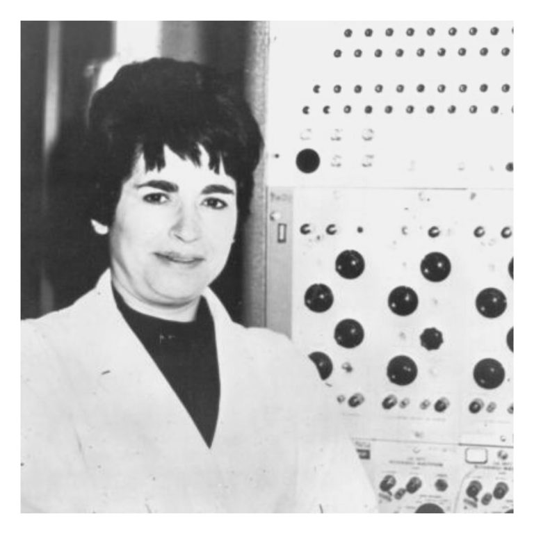

# Grupo Adele Goldstine - Turma 1 (2025.2)

## Sobre o Projeto

Esta página é dedicada à documentação de todos os artefatos criados pelo grupo Adele Goldstine no segundo semestre de 2025, na disciplina de Qualidade de Software 1 da Faculdade de Ciências e Tecnologias em Engenharia da Universidade de Brasília (FCTE-UnB).

### Sobre o i-Educar

O i-Educar é um software livre que descomplica e torna mais eficaz a gestão dos processos escolares, matrículas e dados de alunos. Como principais funcionalidades pode-se destacar a gestão de servidores, controle de transporte escolar, gestão completa do acervo das bibliotecas e geração de relatórios, atestados, boletins e históricos.

A plataforma é utilizada por mais de 80 municípios brasileiros, atende mais de 2050 alunos e impacta mais de 500.000 alunos. Por conta de sua relevância e do contexto educacional que ele visa impactar, o grupo teve forte interesse em utilizá-lo como software de análise na disciplina.

---

## Biografia – Adele Goldstine

Adele Goldstine foi uma das pioneiras da programação de computadores no século XX. Ela é lembrada principalmente por escrever o **manual de operação lógica do ENIAC**, o primeiro computador digital totalmente eletrônico, e por treinar as primeiras mulheres programadoras que trabalharam com essa máquina histórica.

Ela nasceu como **Adele Katz** em 21 de dezembro de 1920, em Nova York, em uma família judia. Era filha de William Katz, empresário de varejo, e tinha uma irmã. Estudou na *Hunter College High School* e posteriormente no *Hunter College*, onde se formou em Matemática. Depois, ingressou na **Universidade de Michigan**, obtendo o título de mestre em Matemática. Nesse período, conheceu **Herman Goldstine**, matemático e cientista da computação que também atuou no desenvolvimento do ENIAC. Eles se casaram em 1941.

Em 1942, Adele ingressou na **Escola Moore da Universidade da Pensilvânia**, onde o Exército dos Estados Unidos financiava pesquisas durante a Segunda Guerra Mundial. Nesse ambiente, cerca de 80 mulheres trabalhavam como “computadores humanos”, realizando manualmente cálculos de trajetórias balísticas. Com a decisão do Exército de financiar o **ENIAC** (*Electronic Numerical Integrator and Computer*), seis dessas mulheres foram selecionadas para se tornarem as primeiras programadoras. Adele desempenhou papel essencial:

- Foi a **primeira programadora do ENIAC**;  
- Escreveu o **Manual do Operador**, documento fundamental para a operação da máquina;  
- Treinou e recrutou as demais programadoras, como Betty Jennings;  
- Implementou, em 1946, a modificação proposta por Dick Clippinger,  que permitiu ao ENIAC executar programas armazenados com até cinquenta instruções.  

O ENIAC, com quarenta painéis de 2,4 metros, não possuía linguagens ou compiladores modernos. A programação era feita conectando cabos, ajustando interruptores e roteando sinais manualmente. A contribuição de Adele foi decisiva para transformar a operação dessa máquina em algo replicável e sistemático.

Após a guerra, Herman Goldstine passou a integrar o **Instituto de Estudos Avançados de Princeton**, trabalhando com John von Neumann. Adele acompanhou o marido para Princeton, mas continuou suas atividades em programação, contribuindo para o projeto de programa armazenado do ENIAC. Com dois filhos nascidos em 1953 e 1960, sua carreira foi interrompida por problemas de saúde. Diagnosticada com câncer, faleceu precocemente em 1964, aos 43 anos.

Adele Goldstine é reconhecida como uma das figuras fundamentais da história da computação. Seu trabalho abriu espaço para mulheres na área, num contexto em que sua atuação era muitas vezes invisibilizada. Hoje, sua biografia inspira pesquisas acadêmicas e movimentos pela valorização das pioneiras da ciência e tecnologia.

  
<b>Figura 1: Adele Goldstine</b>

    

---

## Equipe

<table>
  <tr>
    <td align="center">
      <a href="http://github.com/andre-maia51">
        
         <b>André Maia</b>
      </a>
    </td>
    <td align="center">
      <a href="https://github.com/Caio-Antonio">
        
         <b>Caio Antônio</b>
      </a>
    </td>
    <td align="center">
      <a href="https://github.com/ccarlaa">
        
         <b>Carla Ribeiro</b>
      </a>
    </td>
    <td align="center">
      <a href="https://github.com/manuvaladares">
        
         <b>Manuella Valadares</b>
      </a>
    </td>
    <td align="center">
      <a href="https://github.com/devMarcosVM">
        
         <b>Marcos Marinho</b>
      </a>
    </td>
    <td align="center">
      <a href="https://github.com/ZenildaVieira">
        
         <b>Zenilda Vieira</b>
      </a>
    </td>
  </tr>
</table>

---

## Bibliografia

> Autumn Stanley. *Mães e Filhas da Invenção: Notas para uma História Revisada da Tecnologia*. Rutgers University Press, 1995. 

> W. Barkley Fritz. *As Mulheres do ENIAC*. *IEEE Annals of the History of Computing*, v. 18, n. 3, 1996.

> i-Educar. *Sobre o i-Educar*. Disponível em: <[i-educar](https://ieducar.org/)>

---

## Histórico de Versões

|Versão|Data|Descrição|Autor|Revisor|
|:----:|----|---------|-----|:-------:|
|`1.0`|26/09/2025|Adição da Biografia da Adele|[Zenilda Vieira](https://github.com/ZenildaVieira)|[André Maia](http://github.com/andre-maia51)|
|`1.1`|27/09/2025|Adição das informações gerais do projeto e do i-Educar|[André Maia](http://github.com/andre-maia51)|[Zenilda Vieira](https://github.com/ZenildaVieira)|