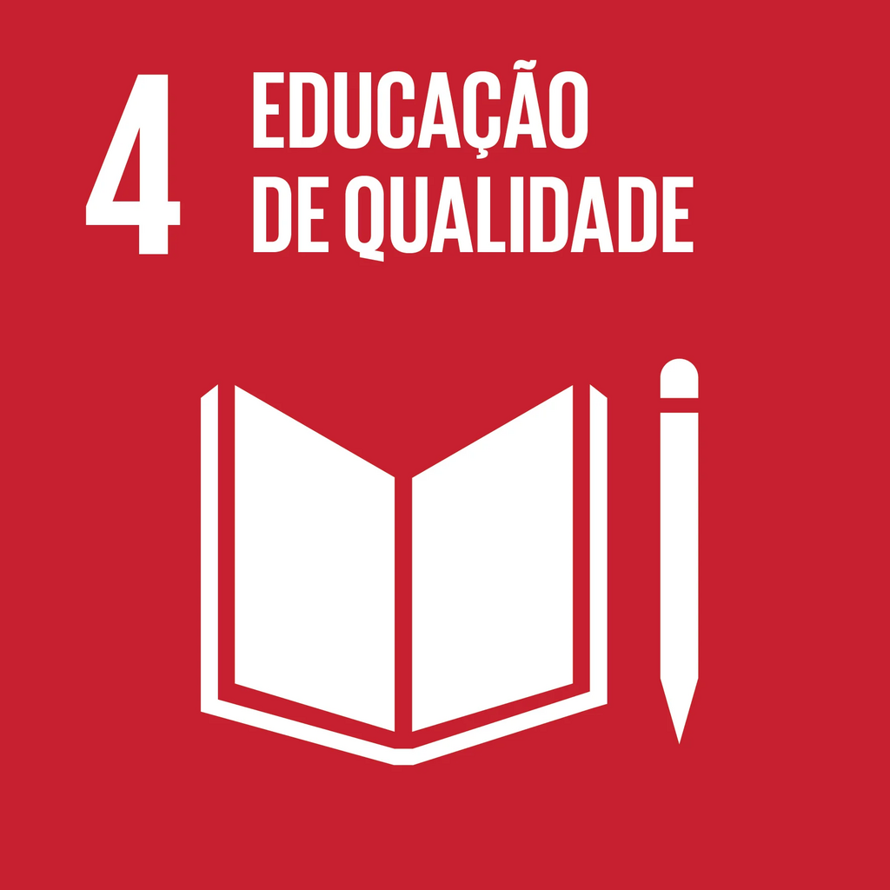
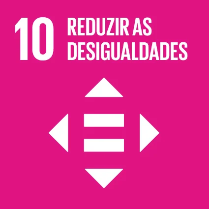
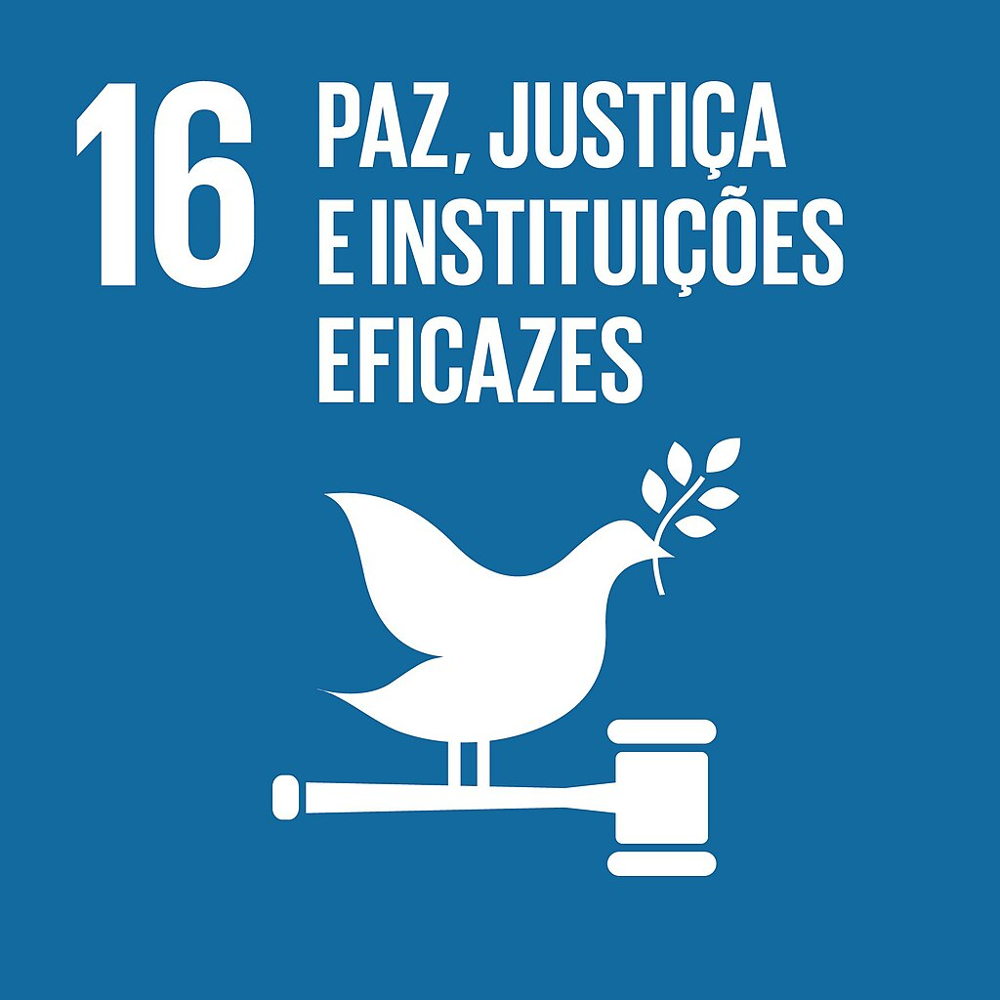

# ODS Relacionados

## Introdução

Aqui descrevemos os Objetivos de Desenvolvimento Sustentável com os quais o i-Educar se conecta, com metas/indicadores relevantes e justificativas de como o software pode contribuir para alcançá-los.

---

### ODS 4 — Educação de Qualidade  

  

    

      
      
<b>Figura 1: ODS 4</b>

    

    

      
<b>Descrição: </b> Assegurar educação inclusiva, equitativa e de qualidade, e promover oportunidades de aprendizagem ao longo da vida para todos. 
      (<a href="https://www.ipea.gov.br/ods/ods4.html">IPEA - ODS 4</a>)

    

  

**Descrição:** Assegurar educação inclusiva, equitativa e de qualidade, e promover oportunidades de aprendizagem ao longo da vida para todos. ([IPEA - ODS 4](https://www.ipea.gov.br/ods/ods4.html))  

**Metas relevantes (Brasil / IPEA):**  
- Meta 4.1: Até 2030, garantir que todas as meninas e meninos completem o ensino primário e secundário gratuito, equitativo e de qualidade, com resultados de aprendizagem eficazes.  
- Meta 4.3: Assegurar igualdade de acesso para todos os gêneros à educação técnica, profissional e superior de qualidade, a preços acessíveis, incluindo universidade.  
- Meta 4.4: Aumentar substancialmente o número de jovens e adultos com habilidades relevantes, inclusive competências técnicas e profissionais, para emprego, trabalho decente e empreendedorismo.  
- Meta 4.a: Construir e melhorar instalações físicas para educação, apropriadas para crianças, sensíveis às deficiências e ao gênero, e que proporcionem ambientes de aprendizagem seguros, inclusivos e eficazes.  

**Indicadores relacionados:**  
- Proporção de jovens de 15-17 anos matriculados no ensino médio.  
- Proficiência em leitura e matemática em diferentes fases do ensino fundamental.  
- Infraestrutura escolar (acessibilidade, segurança, salas e equipamentos).  

**Relação com o i-Educar:**  
- Fornece dados precisos sobre matrícula, frequência, conclusão e desempenho acadêmico, apoiando o monitoramento das metas 4.1 e 4.3.  
- Identifica desigualdades regionais e socioeconômicas, permitindo intervenções mais justas.  
- Apoia a gestão de recursos e relatórios que evidenciem deficiências de infraestrutura.  

---

### ODS 10 — Redução das Desigualdades 

  

    

      
      
<b>Figura 2: ODS 10</b>

    

    

      
<b>Descrição: </b>Reduzir a desigualdade dentro dos países e entre eles.  
      (<a href="https://www.ipea.gov.br/ods/ods10.html">IPEA - ODS 10</a>)

    

  

**Metas relevantes (Brasil / IPEA):**  
- Meta 10.1: Até 2030, sustentar o crescimento da renda dos 40% mais pobres a uma taxa maior que a média nacional.  
- Meta 10.2: Empoderar e promover inclusão social, econômica e política de todos, independentemente de idade, gênero, deficiência, raça, etnia ou condição econômica.  

**Indicadores relacionados:**  
- Taxa de crescimento da renda dos 40% mais pobres em comparação à média nacional.  
- Medidas de inclusão em acesso à educação, conectividade digital e recursos de gestão.  

**Relação com o i-Educar:**  
- Reduz desigualdades de acesso à informação e gestão entre redes escolares.  
- Identifica grupos vulneráveis (por localização, deficiência ou condição socioeconômica), apoiando políticas inclusivas.  
- Democratiza acesso à tecnologia por ser um sistema **open source**, sem custos de licenciamento.  

---

### ODS 16 — Paz, Justiça e Instituições Eficazes  

  

    

      
      
<b>Figura 3: ODS 16</b>

    

    

      
<b>Descrição: </b>Promover sociedades pacíficas e inclusivas, garantir acesso à justiça para todos e construir instituições eficazes, responsáveis e transparentes.  
      (<a href="https://www.ipea.gov.br/ods/ods16.html">IPEA - ODS 16</a>)

    

  

**Descrição:** Promover sociedades pacíficas e inclusivas, garantir acesso à justiça para todos e construir instituições eficazes, responsáveis e transparentes. ([IPEA - ODS 16](https://www.ipea.gov.br/ods/ods16.html))  

**Meta relevante (Brasil / IPEA):**  
- Meta 16.6: Desenvolver instituições eficazes, responsáveis e transparentes em todos os níveis.  

**Relação com o i-Educar:**  
- Mantém registros escolares auditáveis e confiáveis, fortalecendo a transparência.  
- Apoia a eficiência administrativa, reduz duplicidades e melhora o controle institucional.  
- Favorece a confiança pública ao disponibilizar informações de forma organizada e acessível.  

---

### Conclusão 

O i-Educar demonstra alinhamento direto com os Objetivos de Desenvolvimento Sustentável, em especial os ODS 4, 10 e 16. Ao promover inclusão digital, organização e acesso à informação, o sistema contribui para uma educação de qualidade mais eficiente e transparente (ODS 4). Por ser uma solução open source, possibilita sua adoção em redes públicas de ensino sem custos de licenciamento, democratizando o acesso à tecnologia e reduzindo desigualdades (ODS 10). Além disso, fortalece a governança e a eficiência institucional no setor educacional, garantindo maior transparência e confiança nos processos de gestão (ODS 16). Essa integração reflete o princípio central da Agenda 2030 — *não deixar ninguém para trás* — ao favorecer a equidade por meio do monitoramento de desempenho escolar, a inclusão ao ampliar o acesso a ferramentas de gestão e a transparência ao assegurar registros auditáveis e acessíveis.
 
